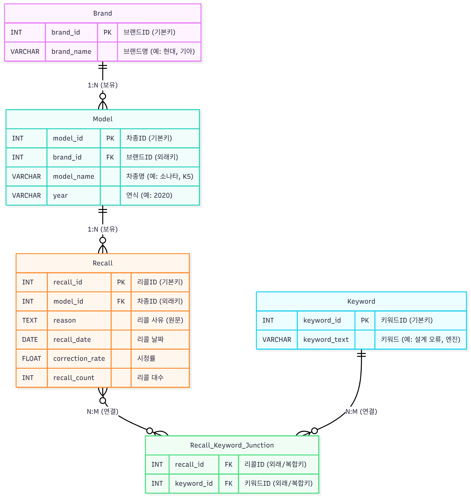

# 🍋 레몬 스캐너 (Lemon Scanner)

**자동차 리콜 현황 분석 및 비교 대시보드 (SK Networks Family AI Camp 22기 4조 1차 프로젝트)**


## 1. 🚀 프로젝트 소개

이 프로젝트는 SK Networks Family AI Camp 22기 4조의 1차 프로젝트입니다.

국내에 등록된 차량의 리콜 데이터를 수집, 분석하여 사용자에게 유용한 정보로 제공하는 것을 목표로 합니다. '내 차'의 리콜 이력뿐만 아니라, 구매하고자 하는 중고차의 잠재적 결함을 확인하고, 브랜드별 리콜 통계를 비교 분석할 수 있는 기능을 제공합니다.

---

## 2. 🛠️ 주요 기능

-   **메인 대시보드**: 전체 리콜 현황, 최다 리콜 브랜드 등의 통계를 요약하고 최신 리콜 뉴스와 꿀팁을 제공합니다.
-   **상세 검색**: 브랜드, 차종, 연도, 핵심 키워드를 조합하여 리콜 내역을 상세하게 검색합니다.
-   **차량 비교**: 두 개의 특정 차종을 선택하여 총 리콜 건수, 평균 시정률, 주요 결함 키워드를 시각적으로 비교합니다.
-   **브랜드 리포트**: 전체 브랜드의 리콜 건수 순위와 평균 시정률 순위를 확인하여 가장 신뢰할 수 있는 브랜드를 분석합니다.
-   **모델 프로필**: 특정 차량 모델의 리콜 사유를 **워드 클라우드(Word Cloud)**로 시각화하고, 전체 리콜 이력을 제공합니다.

---

## 3. ⚙️ 기술 스택 및 아키텍처

-   **Frontend**: `Streamlit`
-   **Backend**: `Python`, `Pandas`
-   **Database**: `MySQL`
-   **APIs**: `Naver Search API` (뉴스 검색용)
-   **Visualization**: `Altair`, `Matplotlib`, `WordCloud`

### 데이터베이스 ERD



### 프로젝트 구조
```
SKN22-1st-4Team/
├── 0_🏠_메인.py           (메인 앱 실행 파일)
├── backend/              (모든 백엔드 로직 패키지)
│   ├── db_manager.py     (DB 연결 관리)
│   ├── ...
├── pages/                (Streamlit 서브 페이지)
│   ├── ...
├── sql/                  (DB 스키마 및 데이터 로더)
│   ├── ...
├── assets/               (이미지 등 정적 파일)
│   └── erd_diagram.png
├── .streamlit/
│   └── secrets.toml
└── requirements.txt
```

---

## 4. 💾 데이터 출처

-   본 프로젝트의 데이터는 공공데이터포털의 **[한국교통안전공단_자동차 리콜대수 및 시정률](https://www.data.go.kr/data/15125831/fileData.do)** 데이터를 기반으로 합니다.
-   4조에서 가공한 **'4조 프로젝트 자동차 리콜현황 Datebase.xlsx'** 파일을 `sql/load_data_from_excel.py` 스크립트를 통해 MySQL DB에 적재하여 사용하였습니다.
-   최신 뉴스는 **[Naver Search API](https://developers.naver.com/products/service-api/search/search.md)**를 통해 실시간으로 수집됩니다.

---

## 5. 👤 팀원 소개

| 이름 | 역할 |
| :--- | :--- |
| **장완식** (팀장) | DB 설계, 백엔드 로직 개발, Streamlit 앱 개발 |
| **문승준** (팀원) | 데이터 가공, 데이터 시각화 |
| **박준석** (팀원) | 백엔드 로직 개발, Streamlit 앱 개발 |
| **이도훈** (팀원) | 백엔드 로직 개발, Streamlit 앱 개발 |
| **최민호** (팀원) | 데이터 가공, 데이터 시각화 |

---

## 6. LICENSE

This project is licensed under the **MIT License**.
See the `LICENSE` file for details.